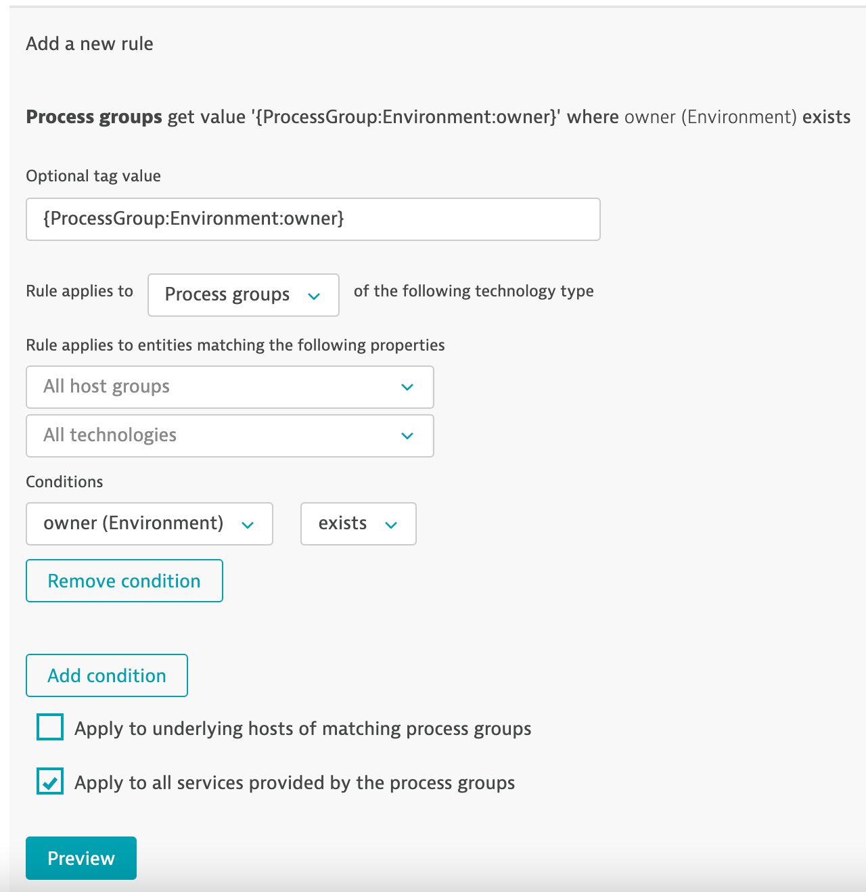
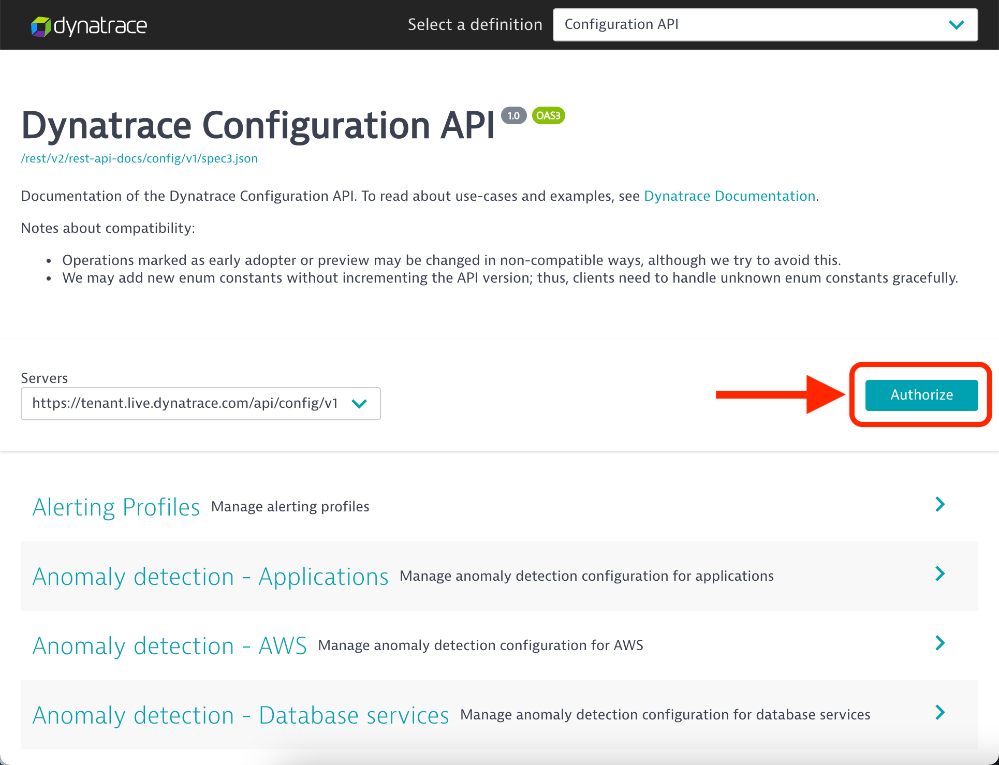
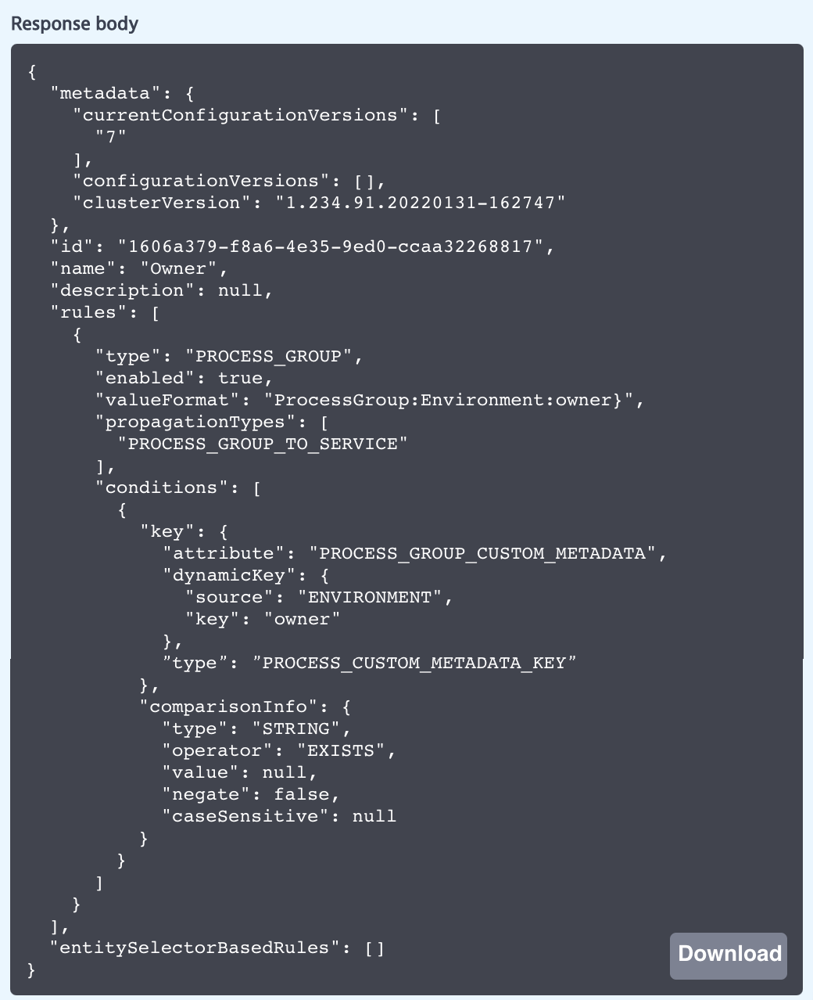

# Automatic tagging rule

In this exercise we'll begin by creating an automatic tagging rule via the Dynatrace web UI. We'll then use the Dynatrace Configuration API to export the automatic tag configuration in JSON format. We'll then use this exported configuration to build our Monaco project files. Once our project structure is complete, we'll remove our automatic tag via the Dynatrace web UI and re-create it using Monaco!

## Step 1 - Create an automatic tagging rule in Dynatrace
First, we'll create an automatic *key:value* tag that identifies the owners of process groups. The value of this tag will be extracted from custom metadata already present on process groups.

1. Go to your Dynatrace tenant and on the left navigation panel expand `Manage` and select `Settings`

2. Navigate to `Tags` > `Automatically applied tags`

3. Click on `Create tag`

4. Set `Tag name` to:
  
    ```
    Owner
    ```

5. Click on `Add a new rule`

6. Set `Optional tag value` to:
   
    ```
    {ProcessGroup:Environment:owner}
    ```

7. Rule applies to `Process Groups`

8. Condition will be `owner (environment) - Exists`

    >**Tip:** Open up the drop-down menu and start typing to immediately jump to the desired option.

9. Check the box `Apply to all services provided by the process groups`

    

10. Click on `Preview`

11. Click on `Create rule`

12. Click on `Save changes`

You can now filter **process groups** and **services** using the `Owner` tag!


## Step 2 - Define a Dynatrace environment for Monaco
For Monaco, Dynatrace environments are defined in an environments file. This file named `environments.yaml` contains the environment URL and the name of an environment variable that contains the API token. Multiple environments can be specified.

We'll use Gitea to edit files in our repository.

1. Go to your Gitea instance and open the `perform` repository

    

2. Navigate into the `perform/monaco/01_exercise_one/projects` folder

3. Open and edit (click on pencil icon) the `environments.yaml` file

4. Remove all contents in `environments.yaml` and copy-paste the snippet below into it

    ```yaml
    perform:
      - name: "perform"
      - env-url: "YOUR_TENANT_URL_GOES_HERE"
      - env-token-name: "DT_API_TOKEN"
    ```

5. Update the `env-url` value to your Dynatrace tenant address. Include `https://` but ensure there is no trailing `/` at the end of the URL.

    > **Tip:** You can find your Dynatrace tenant URL on your dashboard page.

    The file should now look something like this:

    

    > **Note:** The YAML value `DT_API_TOKEN` refers to an environment variable with the same name that we'll set later.

6. Click on `Commit Changes`

Return to the `projects` folder. Here you'll find a folder called `perform` (referenced in the `environments.yaml` file) that contains another folder called `auto-tag` with two files `auto-tag.json` and `auto-tag.yaml`. 

Both files contain only placeholders for the moment. We'll need to update them.

* The JSON file is a template used for our API payload we plan to use to create an automatic tagging rule.

* The YAML file is used for the values we want to populate our JSON file with. 

The YAML file can contain multiple configurations instances that can build different tag names and rules as Monaco will iterate through each instance and apply it to the JSON configuration template. In this exercise, we're simply deploying a single automatic tagging rule called `Owner`.

## Step 3 - Build a Monaco configuration template from the Dynatrace API
A great way to start building your Monaco project is by starting off from an existing Dynatrace configuration. Even if you're starting with a fresh Dynatrace environment, it may be worth creating a sample configuration in the web UI first. Then you can use the Dynatrace Configuration API to export the properties of the configuration in JSON for use in Monaco. From there, you can use your configuration YAML file to add additional configurations.

1. To use the Dynatrace Swagger UI, we need to get our API token which is stored in a Kubernetes Secret. On your VM, execute the command below to retrieve your Dynatrace API token.

    ```bash
    echo && kubectl -n dynatrace get secret oneagent -o jsonpath='{.data.apiToken}' | base64 -d | xargs echo && echo
    ```

2. Paste your token into a notepad for later use

3. Open your Dynatrace tenant, click on the profile icon on the top right and select `Configuration API`

4. Once in the Dynatrace Configuration API Swagger UI, click on `Authorize`

    

5. Paste your token into the value field and click on `Authorize` and then click on `Close`

    >**Tip:** The token value is not checked when you click on `Authorize` so ensure you're pasting the correct value. If you make a mistake here, the next steps will fail with `401 Error: Unauthorized`

6. Now we need to get the ID of the tag `Owner` we manually created through the web UI earlier. Find the `Automatically applied tags` endpoint and expand it.

    

7. Expand `GET /autoTags`

8. Click on `Try it out`

9. Click on `Execute`

10. Scroll down to the response body and copy the ID of the `Owner` tag

    

Next, we'll get the actual configuration of the `Owner` tag

12. Expand `GET /autoTags/{id}`

13. Click on `Try it out`

14. Paste the ID into the required `id` field

15. Set the boolean flag `includeProcessGroupReferences` to `true`

16. Click on `Execute`

17. Scroll down to the response body

    

    Copy the entire response body to your clipboard, from and including the opening curly bracket to and including the closing curly bracket.

18. Go to Gitea and edit file `perform/monaco/01_exercise_one/projects/perform/auto-tag/auto-tag.json`

    

19. Remove the placeholder and paste the copied response body from the Dynatrace API output, but don't commit the changes just yet.

20. The first few lines contain identifiers of the existing configuration which cannot be included in the payload when creating a configuration. Therefore, we need to remove these lines starting with and including line `"metadata"` until and including line `"id"`. 

    The desired file contents should now look like the snippet below:

    ```json
    {
      "name": "Owner",
      "rules": [
        {
          "type": "PROCESS_GROUP",
          "enabled": true,
          "valueFormat": "{ProcessGroup:Environment:owner}",
          "propagationTypes": [
            "PROCESS_GROUP_TO_SERVICE"
          ],
          "conditions": [
            {
              "key": {
                "attribute": "PROCESS_GROUP_CUSTOM_METADATA",
                "dynamicKey": {
                  "source": "ENVIRONMENT",
                  "key": "owner"
                },
                "type": "PROCESS_CUSTOM_METADATA_KEY"
              },
              "comparisonInfo": {
                "type": "STRING",
                "operator": "EXISTS",
                "value": null,
                "negate": false,
                "caseSensitive": null
              }
            }
          ]
        }
      ]
    }
    ```

21. Commit the changes

## Step 4 - Build the configuration YAML
1. Now let's edit file `perform/monaco/01_exercise_one/projects/perform/auto-tag/auto-tag.yaml`

2. Remove the placeholder and copy the contents below into the YAML file

    ```yaml
    config:
        - tag-owner: "auto-tag.json"
      
    tag-owner:
        - name: "Owner"
    ```

    > **Note:** Monaco requires that the configuration YAML contains the `name` attribute.
    >
    > The config YAML tells Monaco which configuration JSON to apply. You can supply additional configuration names with separate JSON files.
    >
    > Each config name has a set of properties to apply to the JSON template. In our case we're telling Monaco to use the `auto-tag.json` file for our `tag-owner` configuration.

3. Commit the changes

## Step 5 - Make the Monaco JSON more dynamic
Next, we'll update our JSON configuration file to be more dynamic and use variables to populate the tag name. This makes it possible to have our config YAML iterate through multiple tag names and configurations.

1. Go to Gitea and edit file `perform/monaco/01_exercise_one/projects/perform/auto-tag/auto-tag.json`

2. On line 2, replace `Owner` with the snippet below, preserving the double quotes that were already there:

    ```json
    {{ .name }}
    ```
    Our JSON template is now going to use the property `name` that is defined in the config YAML. This practice provides flexibility to define multiple configurations or values from other sources and populate them dynamically.

    Expected JSON file contents:

    ```json
    {
      "name": "{{ .name }}",
      "rules": [
        {
          "type": "PROCESS_GROUP",
          "enabled": true,
          "valueFormat": "{ProcessGroup:Environment:owner}",
          "propagationTypes": [
            "PROCESS_GROUP_TO_SERVICE"
          ],
          "conditions": [
            {
              "key": {
                "attribute": "PROCESS_GROUP_CUSTOM_METADATA",
                "dynamicKey": {
                  "source": "ENVIRONMENT",
                  "key": "owner"
                },
                "type": "PROCESS_CUSTOM_METADATA_KEY"
              },
              "comparisonInfo": {
                "type": "STRING",
                "operator": "EXISTS",
                "value": null,
                "negate": false,
                "caseSensitive": null
              }
            }
          ]
        }
      ]
    }
    ```

3. Commit the changes

## Step 6 - Delete the tagging rule in Dynatrace
Now that our project files are defined for a tagging rule, we'll manually delete the existing automatic tagging rule via the Dynatrace web UI so we can recreate it with Monaco.

1. Open the Dynatrace web UI and navigate to `Settings` > `Tags` > `Automatically applied tags` 

2. Delete the tag called `Owner`

3. Save changes

## Step 7 - Clone repo to VM and run Monaco
We'll now update our local repo from Gitea and execute Monaco from our project structure to re-create the automatic tagging rule.

1. Open the SSH client that is connected to your VM 

2. Navigate into the `perform` directory
   
    ```bash
    cd ~/perform
    ```
  
3. Execute the following command to pull down all the changes we made in Gitea
   
    ```bash
    git pull
    ```

4. Navigate into the Monaco projects folder
   
    ```bash
    cd ~/perform/monaco/01_exercise_one/projects
    ```

5. Create a local environment variable called `DT_API_TOKEN` and populate it with the Dynatrace API token that's stored in a Kubernetes secret.

    ```bash
    export DT_API_TOKEN=$(kubectl -n dynatrace get secret oneagent -o jsonpath='{.data.apiToken}' | base64 -d)
    ```

    Verify that the environment variable is created correctly

    ```bash
    echo $DT_API_TOKEN
    ```

    > **Note:** For this training, we use an environment variable to supply Monaco with our Dynatrace API token. For security reasons, this is not a recommended approach for production environments. Consider storing APIs token safely, e.g. as a secret or in a credential vault.

    ***We're now ready to see Monaco in action!***

6. Execute Monaco with the dry run flag `-d` which will validate our configuration without actually applying it to the Dynatrace tenant.

    The `-e` flag tells Monaco which environment we'd like to execute this config for.
    
    The `-p` flag can be used to specify a project directory. Defining the project folder is optional as by default Monaco will search the current directory for the project folder.

      ```bash
      monaco -d -e environments.yaml
      ```

      Monaco should execute correctly without errors

      ```bash
      You are currently using the old CLI structure which will be used by
      default until monaco version 2.0.0

      Check out the beta of the new CLI by adding the environment variable
        "NEW_CLI".

      2022-02-04 11:24:43 INFO  Dynatrace Monitoring as Code v1.6.0
      2022-02-04 11:24:43 INFO  Executing projects in this order:
      2022-02-04 11:24:43 INFO  	1: perform (1 configs)
      2022-02-04 11:24:43 INFO  Processing environment perform...
      2022-02-04 11:24:43 INFO  	Processing project perform...
      2022-02-04 11:24:43 INFO  Deployment summary:
      2022-02-04 11:24:43 INFO  Validation finished without errors
      2022-02-04 11:24:43 INFO  There is no delete file delete.yaml found in delete.yaml. Skipping delete config.
      ```

7.  Remove the `-d` flag to apply all configurations in the project

      ```bash
      monaco -e environments.yaml
      ```

8.   Open your Dynatrace tenant and verify that the `Owner` tag was recreated

      

## Congratulations on completing Exercise 1!
