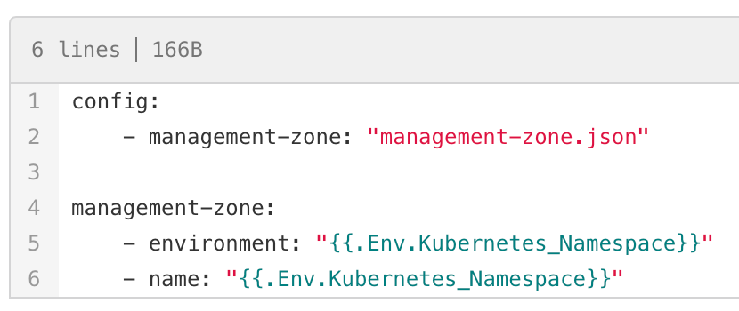
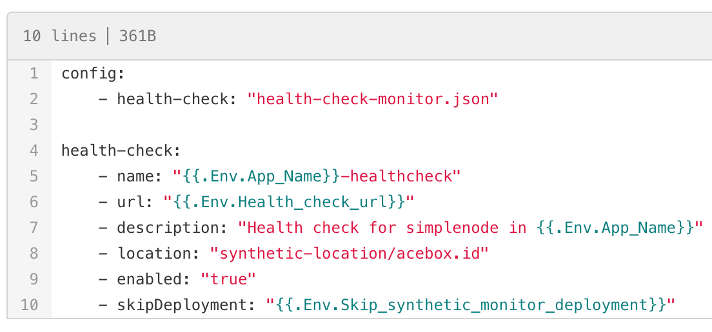
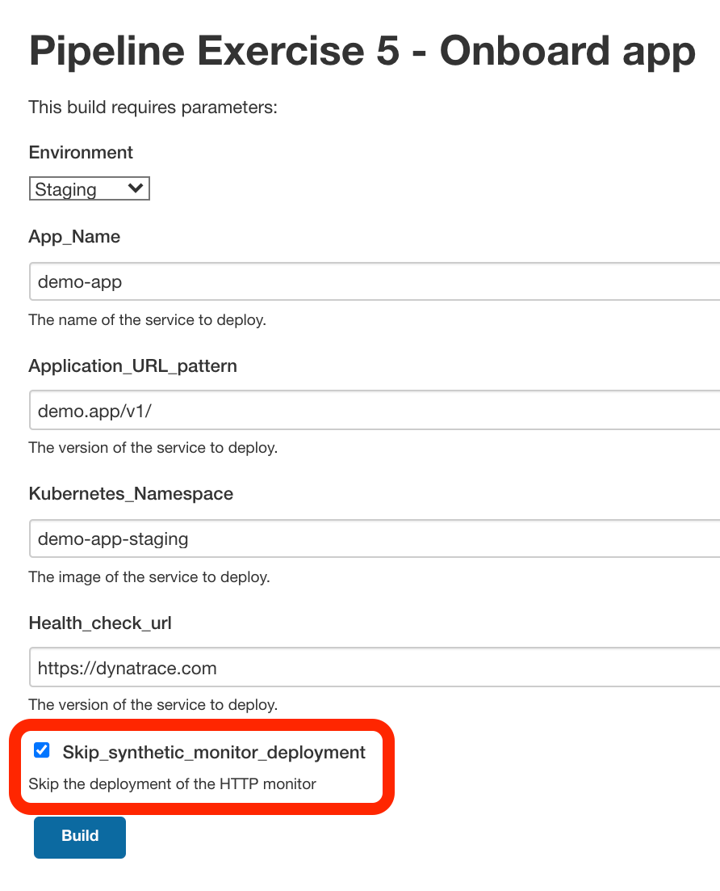
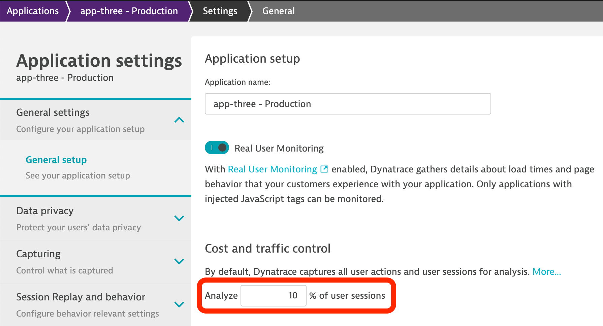

# Onboarding new apps

In this exercise, we'll use templates to onboard new applications and teams.

Application teams might not be that familiar with Dynatrace. Also, they might not really know what they want from the product yet—besides great monitoring of course!

A good way to onboard these teams—especially in a Kubernetes environment—is to create a set of default configurations such as dashboards, management zones, applications, etc. These default configurations can later be adapted by those teams to suit their own specific requirements.

>**Note:** This exercise depends on tag created in exercise two. If the tag was deleted, please run the pipeline of exercise two again.

As part of this exercise, we'll create:

* Management zone
    * Can be used for filtering
    * Can be used to limit access or grant permissions
    * Typically not editable by application teams themselves
* Synthetic Monitor
    * HTTP check to ensure availability
    * Optional deployment
* Dashboard
    * Simple dashboard with a few tiles
    * Already filtered using the correct management zone
* A synthetic location and application detection rule
    * Used to support the above configurations

>**Note:** Of course many more configuration types can be added as part of a deployment, e.g. alerting profile, problem notifications, etc.

## Step 1 - Applying our first template
1. Go to Jenkins `Exercise 5 - Onboard app` and click on `Build with Parameters` and enter the following parameters:

    >**Note:** Don't forget to replace `<YOUR-IP-HERE>` with your VM's IP-address!

    ```
    Environment: Production
    ```

    ```
    App_Name: app-three
    ```

    ```
    Application URL-pattern: 
    simplenode.app-three.<YOUR-IP-HERE>.nip.io
    ```

    ```
    Kubernetes_Namespace: app-three
    ```

    ```
    health_check_url: 
    http://simplenode.app-three.<YOUR-IP-HERE>.nip.io/api/invoke?url=https://www.dynatrace.com
    ```

    ```
    Skip_synthetic_monitor_deployment: should be unchecked
    ```

    When correctly filled out, you should have this: 

    


2. Click on `Build`

3. Confirm in Dynatrace that the application, management zone, dashboard, and synthetic monitor have been created. 

    Also check if the synthetic monitor is working correctly and that user actions on the page ```http://simplenode.app-three.<YOUR-IP-HERE>.nip.io``` are mapped into the created application.

    >**Note:** It can take a minute or two for all the data to come in.

## Step 2 - Optional configuration
Let's take a look at some of the configurations that we applied.

1. First, let's look at the management zone. The `zone.yaml` file uses the environment variable `{{.Env.Kubernetes_Namespace}}` which we previously specified in the build pipeline. This is then setup to provide the name and apply the correct filter for the management zone in the management zone JSON file.

    

2. If we take a look at the synthetic monitor in `synthetic-monitors.yaml`, we can see it has a parameter "skipDeployment". This parameter allows us to skip certain parts from being applied.

    

3. Run the pipeline with defaults but tick the box `Skip_synthetic_monitor_deployment`.

    

4. Confirm in Dynatrace that all configuration items were created, except for the synthetic monitor.

    This can also be checked by inspecting the Jenkins console output:

    ```
    2022-02-04 11:45:31 INFO  			skipping deployment of health-check: monaco/05_exercise_five/template/synthetic-monitor/
    ```

## Step 3 - Managed or un-managed configuration
1. Change the RUM capture rate of app-three production to 10% by going to `Applications` > `app-three - Production` > Click on the three dots on the top right (`...`) > Click on `Edit`

    

2. Run the pipeline again with the parameters from Step 1. If everything worked, your edits have now been removed. Why is that?

3. Let's make the same edits we just made, but now run the pipeline with the pre-filled demo values. If everything went well, our changes are still in place. Why is that?

    > **Note:** Changes made by users to managed configurations in Dynatrace can be lost when we run the pipeline again with the same parameters. This might not be a problem—e.g. if we want users to make edits in Dynatrace from a managed configuration starting point. We just have to make sure we don't run the pipeline again with the same parameters. An easy way to prevent that, is by adding a step in the pipeline that stops if a configuration already exists.
    >
    > In other scenarios, we might want to create a lot of managed configuration automatically. In that case, we'd need a solution that automatically modifies and expands the YAML files whenever the pipeline runs. That will take away (some) ability to edit configurations directly inside Dynatrace by application teams, as all edits will have to happen through Monaco.
    >
    > Currently, a configuration that exists in Dynatrace doesn't get merged with a configuration that's deployed by Monaco. For example, automatically merge user action names from an application in Dynatrace with those inside a Monaco configuration.

We hope this exercise has made it clear that templates can save us a lot of time and effort when onboarding new applications and users into Dynatrace.

## Congratulations on completing Exercise 5!
